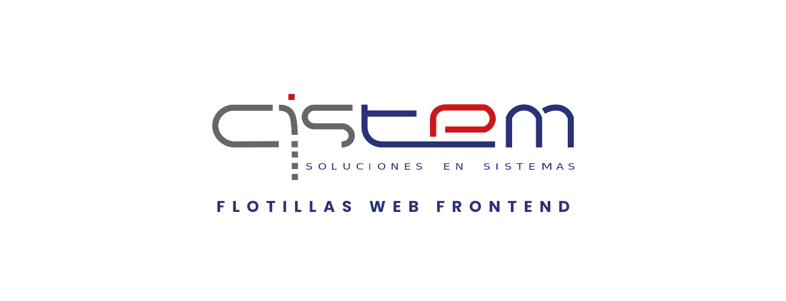

# **CistemTool-Frontend**



**CistemTool-Frontend**, es una iniciativa que tiene como objetivo almacenar técnicas o estrategias utiles que se pueden implementar del lado del Frontend.

## ✅ **Guía de Instalación**

A continuación, se describirán los pasos para el montaje del proyecto:

1. Clona el repositorio **[CistemTool-Frontend](https://github.com/danielG-cistem/CistemTool-Frontend.git)**:

```
https://github.com/danielG-cistem/CistemTool-Frontend.git
```

2. Instala los modulos de Node JS: 

```
npm install
```

> **Nota**: Necesitas tener instalado **[Node JS](https://nodejs.org/en/)** previamente. Según la **[Documentación Oficial de Vue](https://vuejs.org/guide/quick-start.html#creating-a-vue-application)**, se necesita Node en una versión **```16.0 o superior```**.

3. Iniciar aplicación (modo desarrollo):

```
npm run dev
```

Si has seguido los pasos correctamente, se iniciará un servidor interno de **[Vite](https://vitejs.dev/)** en un puerto especifícado, con el que podrás ingresar a la aplicación.

## ✅ **Topicos**

Conoce otros aspectos internos del proyecto en este repositorio:

✨ **[Convención de Commits](./docs/CONVENTIONAL_COMMITS.md)**

✨ **[Esquema de Versionamiento](./docs/VERSIONING_SCHEME.MD)**

---
© 2015 Cistem Innovación ® | Casa de Software. All Rights Reserved. Soluciones de Cistem Innovación ® Casa de Software.